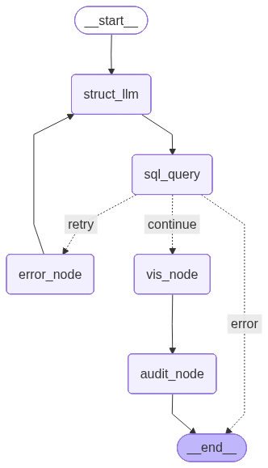
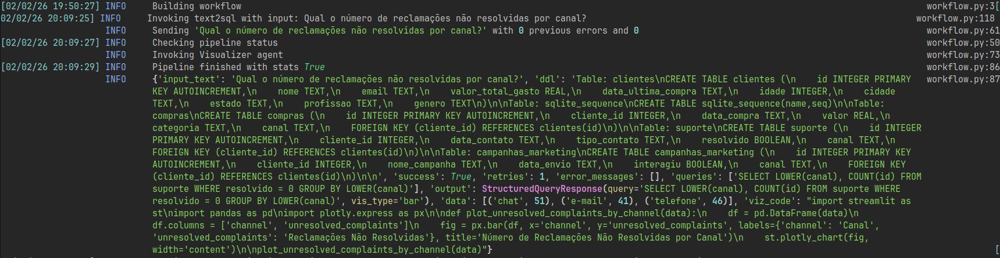
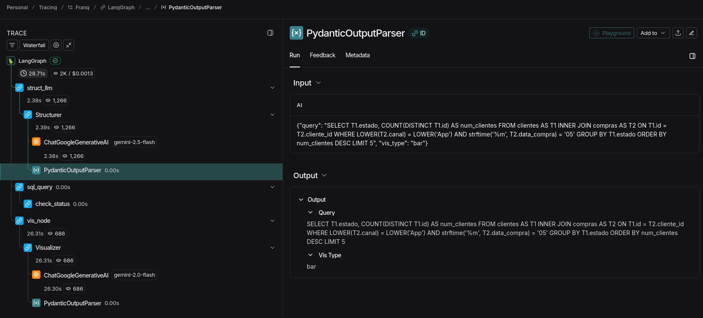
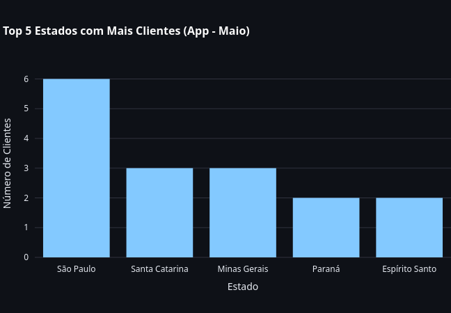
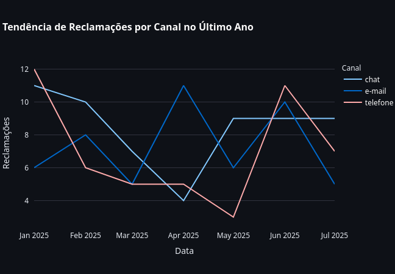

# Franq - SQL chat

Projeto designado para o desafio técnico da Franq. Consiste em implementar uma espécie de **text2sql**, 
onde apenas com linguagem natural é possível realizar umaa consulta e disponibilizar de forma visual (gráficos de barra, linha, pizza, etc). 
A aplicação final se baseia em um chat no qual o usuário pode realizar perguntas
e o assistente virtual responde com uma explicação, ``query`` realizada no banco e a informação visual.


<p align="center">

</p>

## Sumário

1. [Arquitetura dos agentes](#arquitetura-dos-agentes)
2. [Exemplos](#exemplos)
3. [Execução](#execução)
4. [Sugestões e melhorias](#sugestões-e-melhorias)


## Arquitetura dos agentes

Utilizando **Langgraph** projetei um pipeline com dois agentes LLM:
1. **StructurerAgent**: *Transforma* o texto de entrada/pergunta em uma query que condiz com o banco de dados.
2. **VisualizerAgent**: Utiliza os dados retornados pela query e **gera** um código em tempo de execução,
com ``streamlit`` e ``pandas``, retornando para interface.

<p align="center">

</p>


Além disso, foram seguidos os princípios SOLID e utilizado a **Arquitetura limpa** (*domain*, *infrastructure* e *services*).
Logs estruturados e robustos também foram adicionados, a fim de depurar o funcionamento da pipeline. Por fim, 
**Langsmith** foi utilizado para observabilidade.

**Logs**


**Langsmith**


**Definição do grafo**
```python
wf = StateGraph(State)

# nodes
wf.add_node("struct_llm", run_llm_struct)
wf.add_node("sql_query", self.database.run_query)
wf.add_node("error_node", error_handler)
wf.add_node("vis_node", todo_vis_node)
wf.add_node("audit_node", audit_node)
# edges / connections
wf.set_entry_point("struct_llm")
wf.add_edge("struct_llm", "sql_query")
# loop for handling errors
wf.add_conditional_edges(
    "sql_query",
    check_status,
    {
        "retry": "error_node",
        "continue": "vis_node",
        "error": END
    }
)
wf.add_edge("error_node", "struct_llm")
wf.add_edge("vis_node", "audit_node")
wf.add_edge("audit_node", END)
```

## Exemplos

**1**: *Qual o número de reclamações não resolvidas por canal?*

```sql 
SELECT LOWER(canal), COUNT(id) FROM suporte WHERE resolvido = 0 GROUP BY LOWER(canal)
```


---

**2**: *Liste os 5 estados com maior número de clientes que compraram via app em maio.*

```sql
SELECT T1.estado, COUNT(DISTINCT T1.id) AS num_clientes FROM clientes AS T1 INNER JOIN compras AS T2 ON T1.id = T2.cliente_id WHERE LOWER(T2.canal) = LOWER('App') AND strftime('%m', T2.data_compra) = '05' GROUP BY T1.estado ORDER BY num_clientes DESC LIMIT 5
```



---

**3**: *Qual a tendência de reclamações por canal no último ano?*
```sql
SELECT strftime('%Y-%m', data_contato) AS mes, LOWER(canal) AS canal, COUNT(id) AS total_reclamacoes FROM suporte WHERE strftime('%Y', data_contato) = (SELECT MAX(strftime('%Y', data_contato)) FROM suporte) GROUP BY mes, canal ORDER BY mes, canal
```



## Execução

Para executar o projeto basta:
- Gerar uma chave de API do gemini.
- Criar um arquivo ``.env`` na raíza do projeto contendo ``GOOGLE_API_KEY=<chave api>``.
- Com docker e docker compose instalado, execute ``docker compose build --no-cache``.
- E ``docker compose up``.
- Por fim, acesse http://localhost:8501.

## Sugestões e melhorias
Devido ao tempo curto, não consegui implementar todos os recursos que julgo necessário para uma aplicação final, que incluem:
- **Tratamento de erros**: Melhorar o tratamento de erros no pipeline, com mais *exceptions* de domínio, podendo as trata-las de forma adequada.
- **Sanitização**: O código gerado para a visualização é criado e executado em tempo de execução, o que pode trazer falhas de segurança
como injeção de código malicioso.
- **Modularização**: Separação entre frontend e backend, com comunicação através de uma API.
